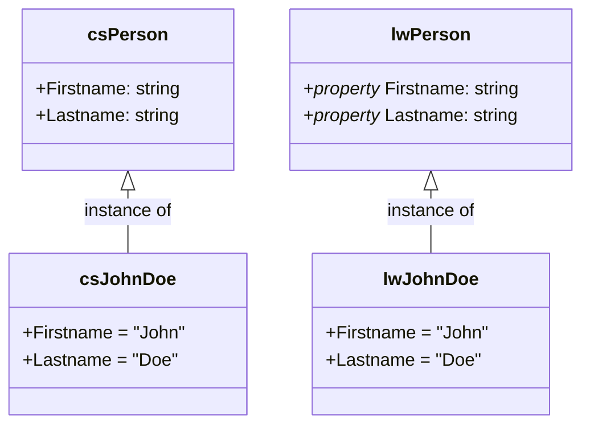
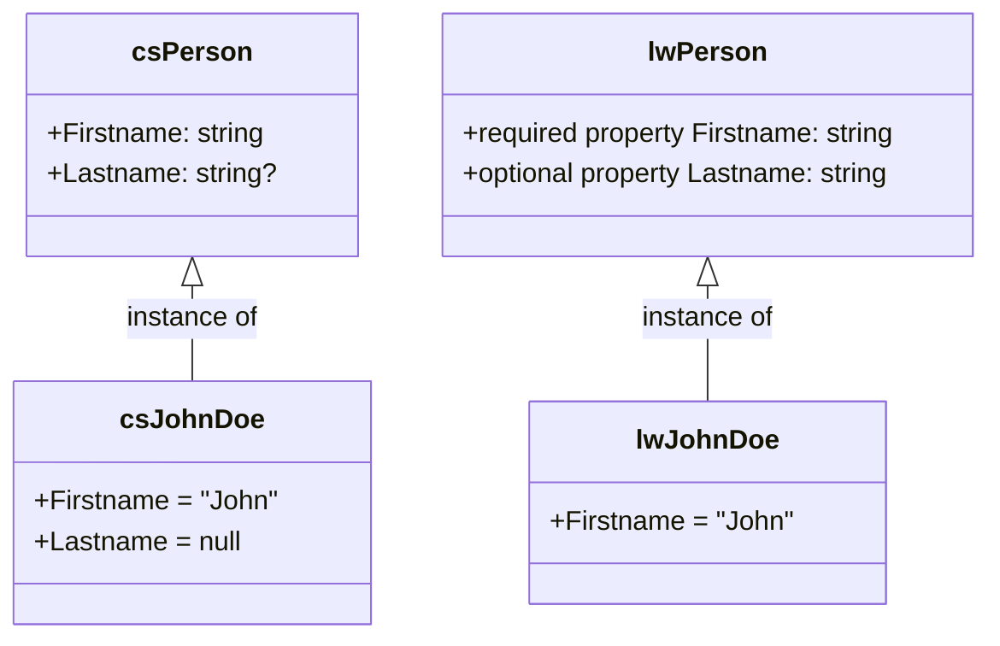

:::note
In this document, the term _property_ and _reference_ may refer to both C# and LionWeb contexts. We'll qualify them with "C#" or "LionWeb" for clarity.
:::

## Everything is an Object / Node

In object-oriented languages like C#, everything is an [object](https://learn.microsoft.com/en-us/dotnet/csharp/fundamentals/object-oriented/objects). Objects have an [identity](https://learn.microsoft.com/en-us/dotnet/csharp/fundamentals/object-oriented/objects#object-identity-vs-value-equality), state, and a type — the object's [class](https://learn.microsoft.com/en-us/dotnet/csharp/fundamentals/types/classes). The object's identity is its memory location, and its state is the value of all its [members](https://learn.microsoft.com/en-us/dotnet/csharp/fundamentals/object-oriented/#members). Relevant members are [fields](https://learn.microsoft.com/en-us/dotnet/csharp/programming-guide/classes-and-structs/fields) and [C# properties](https://learn.microsoft.com/en-us/dotnet/csharp/programming-guide/classes-and-structs/properties).

In LionWeb, everything is a _node_. Nodes have an [id](https://lionweb.io/specification/metametamodel/metametamodel.html#identifiers), state, and a [classifier](https://lionweb.io/specification/metametamodel/metametamodel.html#Classifier) — the node's [concept](https://lionweb.io/specification/metametamodel/metametamodel.html#Concept). The id is a string consisting of uppercase/lowercase `A`-`Z`, `1`-`9`, `-`, and `_`. Like object identity in C#, a node id must be unique but has no semantic meaning.

A node’s state is the value of all its [features](https://lionweb.io/specification/metametamodel/metametamodel.html#Feature): these can be [LionWeb properties](https://lionweb.io/specification/metametamodel/metametamodel.html#Property)[^prefix], [containments](https://lionweb.io/specification/metametamodel/metametamodel.html#Containment), or [LionWeb references](https://lionweb.io/specification/metametamodel/metametamodel.html#Reference).



| C#                        | LionWeb                        |
|--------------------------|--------------------------------|
| object                   | node                           |
| object identity          | node id                        |
| object type              | node classifier                |
| class                    | concept                        |
| class member             | concept feature                |
| field + C# property      | LionWeb property + containment + LionWeb reference |

## ... except Value Types / LionWeb Properties

C# has [_value types_](https://learn.microsoft.com/en-us/dotnet/csharp/language-reference/builtin-types/value-types) that are not objects. Examples include `int` and `bool`.  They don't have any identity; they are purely defined by their value.  

We cannot tell apart `15` from `15`, but we can tell apart the two objects:

```csharp
var a = new Person { Firstname = "John", Lastname = "Doe" };
var b = new Person { Firstname = "John", Lastname = "Doe" };
```

Value types cannot be `null`, unless we declare them _nullable_:

```csharp
int age = 23;
int? numberOfAunts = null;
```

In this example, we always know the person's age, but we might not know how many aunts they have.

LionWeb properties have **value type semantics**[^value-sem], meaning they are purely defined by their value. They can have type `integer`, `boolean`, enumeration, or `string`.

LionWeb properties are either _required_ or _optional_. If required, the LionWeb property must have a value; otherwise, the value can be omitted.

[^value-sem]: Value type _semantics_ because C# `string` is not a value type.



### Mapping to C#

LionWeb properties become C# properties with proper getters and setters. In C# we also have a method like `Person SetFirstname(string value)`. They form a fluent interface.

Optional LionWeb properties have nullable types in C#.
They may return `null`, and can be set to `null`.

Required LionWeb properties have non-nullable types in C#. They may never return `null`. If no value has ever been assigned to this C# property, the C# property getter throws an `UnsetFeatureException`. If set to `null`, the C# property setter, and the `SetProperty()` method, throw an `InvalidValueException`.

```csharp
class Person {
  ...
  public string Firstname { get; set; }
  public Person SetFirstname(string value);
    
  public string? Lastname { get; set; }
  public Person SetLastname(string? value);  
}

...

Person johnDoe = new Person("g1_X");

johnDoe.Firstname;           // throws UnsetFeatureException

johnDoe
  .SetFirstname("John")
  .SetLastname("Doe");

johnDoe.Firstname = null;    // throws InvalidValueException
johnDoe.SetFirstname(null);  // throws InvalidValueException
```

| C#              | LionWeb                 |
|-----------------|-------------------------|
| `int` type      | `integer` property type |
| `bool` type     | `boolean` property type |
| `string` type   | `string` property type  |
| enum            | enumeration             |
| nullable type   | optional feature        |
| non-nullable type | required feature      |