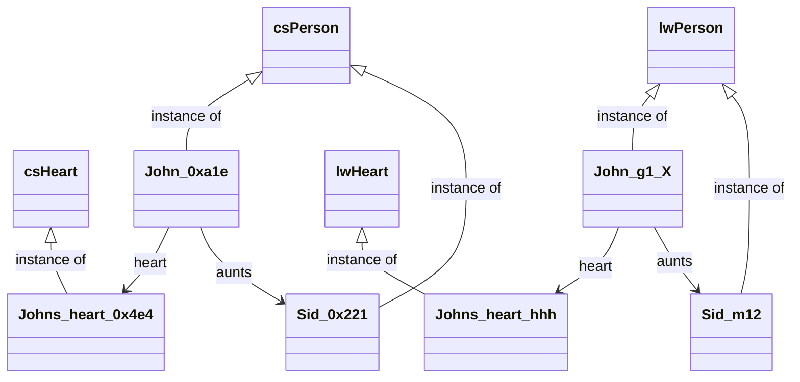
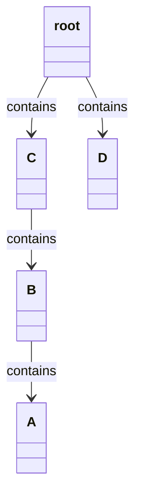
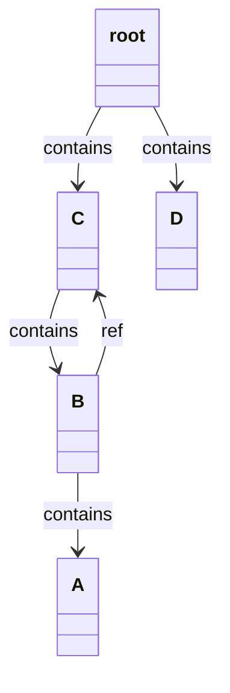
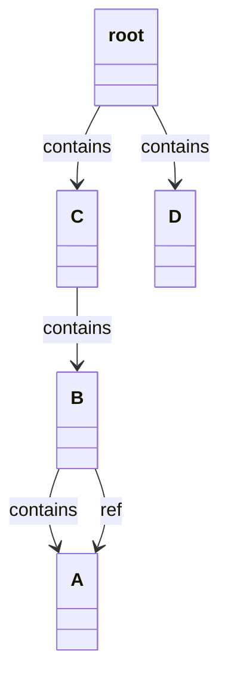
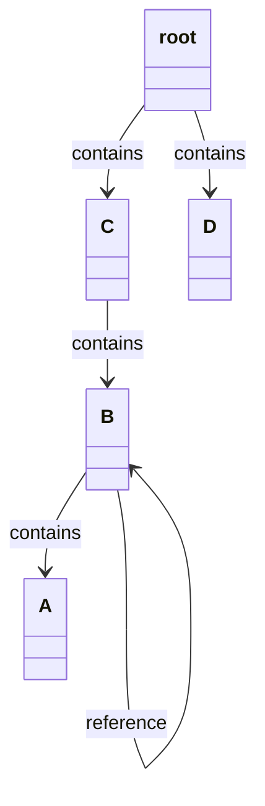
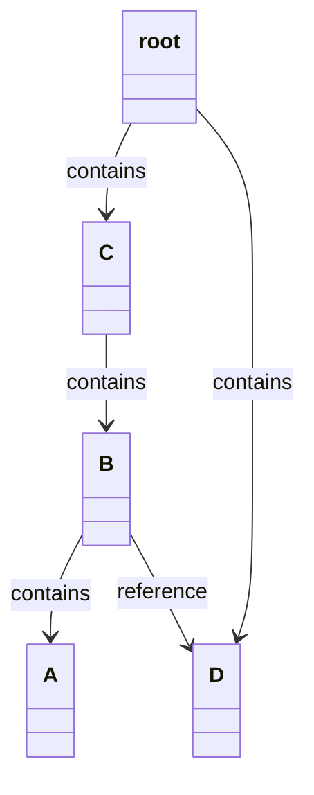
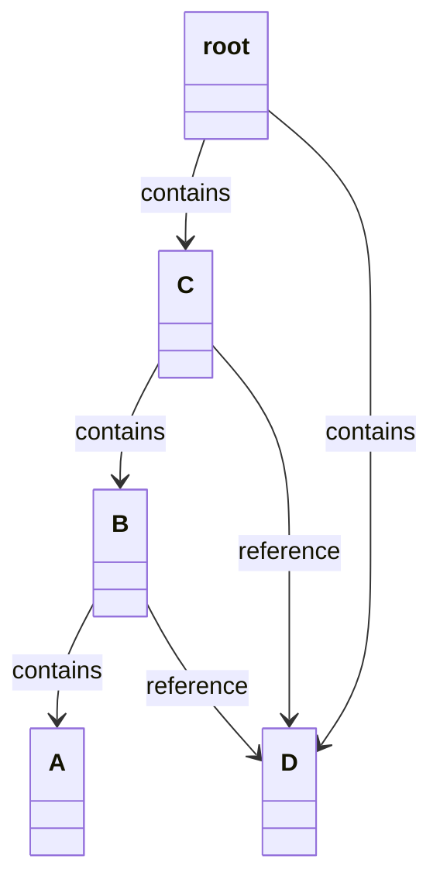
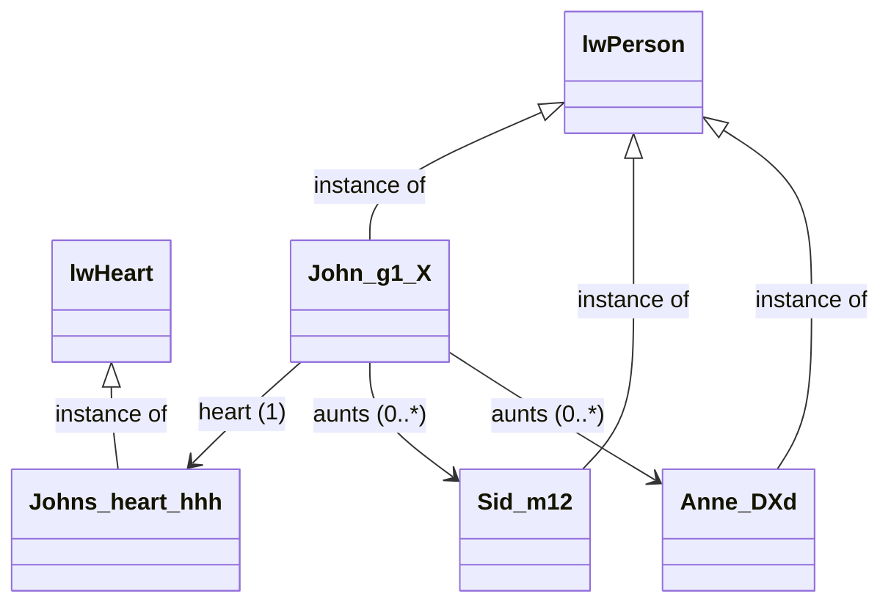
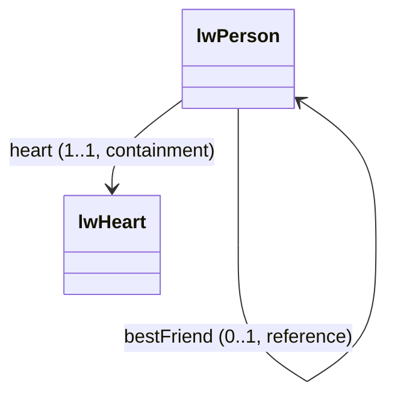
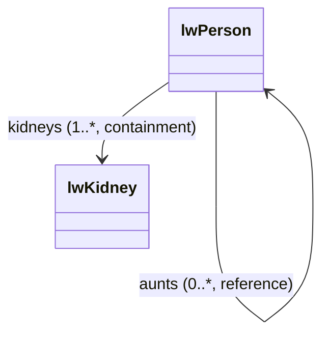

C# always uses
https://learn.microsoft.com/en-us/dotnet/csharp/language-reference/keywords/reference-types[_C# references_] to connect objects. A `Person` object uses C# references to connect to both the person's `Heart` object and their aunts' objects. We cannot "delete" an object, but we can cut all C# references to it -- eventually the garbage collector will delete the object once all C# references to it are unset.

In LionWeb we have two different ways to connect nodes. A `Person` node _contains_ its `Heart` node, but uses a _LionWeb reference_ to connect to the persons' aunts' nodes.
Both _containment_ and _LionWeb reference_ are a _link_.



| C#           | LionWeb                                 |
|--------------|------------------------------------------|
| C# reference | Link + Containment + LionWeb Reference   |


## Containments

Every node `A` is contained in exactly one other node `B`. `B` is contained in `C`, and so on, until we arrive at the _root node_. 

The root node is the only node that is not contained anywhere. Thus, all nodes form a tree.

We usually look at the tree from the top: _root node_ contains `C`, which contains `B`, which contains `A`.Each node has one _parent_ and zero or more _children_. We cannot "delete" a node, but we can _detach_ the node from its parent.

If we detach node `B` from its parent `C`, both `B` and its child `A` are _orphaned_ -- unless we re-attach them to `D`. If not, these nodes stay orphans, and the garbage collector claims them eventually.



## LionWeb References

LionWeb references behave very similar to C# references. We can refer to any other node, no matter where any of the two belongs to.

Removing a LionWeb reference also does not affect anything besides that reference. LionWeb references turn the strict containment tree into a graph with interconnections. 












### Link Cardinality
Links (i.e. containments and LionWeb references) are either _required_ or _optional_, just as LionWeb properties.
Links are also either _singular_ or _multiple_, i.e. the link can point to one or several other nodes. This maps nicely to cardinalities, as known from UML:

|               | Singular | Multiple |
|---------------|----------|----------|
| Optional      | 0..1     | 0..*     |
| Required      | 1..1     | 1..*     |



### Mapping to C#

LionWeb singular links become C# properties with proper getters and setters. Singular links have a method like `Person SetHeart(Heart value)` in C#. They form a fluent interface.

Their method parameter type and C# property type for a singular link is nullable for optional links. They may return `null`, and can be set to `null`.

Required singular links have non-nullable types in C#. They may never return `null`.
If no value has ever been assigned to this C# property, the C# property getter throws an `UnsetFeatureException`. If set to `null`, the C# property setter, and the `SetLink()` method, throw an `InvalidValueException`.



```csharp
class Person {
  ...
  public Heart OwnHeart { get; set; }
  public Person SetOwnHeart(Heart value);
    
  public Person? BestFriend { get; set; }
  public Person SetBestFriend(Person? value);  
}

...

Person john = new Person("g1_X") { OwnHeart = new Heart("hhh") };
Person sid = new Person("-12");

john.SetBestFriend(sid);
var friend = john.BestFriend;

john.OwnHeart = null;  // throws InvalidValueException

sid.OwnHeart;          // throws UnsetFeatureException
```

LionWeb multiple links become C# properties with only getters. They always return `IReadOnlyList<LinkType>`, never `null`. The resulting enumerable cannot be modified -- it doesn't even offer appropriate methods. Instead of setters or direct manipulation of the result, we have several methods for each multiple link: `AddLink(IEnumerable<LinkType>)`, `InsertLink(int index, IEnumerable<LinkType>)`, `RemoveLink(IEnumerable<LinkType>)`.

Optional multiple links may return empty `IReadOnlyList`, and all existing elements can be removed.

Required multiple links never return `null` or an empty list. If the list is empty, the C# property getter throws an `UnsetFeatureException`. Trying to remove all entries from a required multiple link throws an `InvalidValueException`.



```csharp
class Person {
  ...
  public IReadOnlyList<Kidney> Kidneys { get; }
  public Person AddKidneys(IEnumerable<Kidney> nodes);
  public Person InsertKidneys(int index, IEnumerable<Kidney> nodes);
  public Person RemoveKidneys(IEnumerable<Kidney> nodes);
    
  public IReadOnlyList<Person> Aunts { get; }
  public Person AddAunts(IEnumerable<Person> nodes);
  public Person InsertAunts(int index, IEnumerable<Person> nodes);
  public Person RemoveAunts(IEnumerable<Person> nodes);
}

...

Person john = new Person("g1_X") { Kidneys = [new Kidney("s3S")] };
Person sid = new Person("-12");

john.AddAunts([sid]);
var onlyKidney = john.Kidneys.First();

john.Kidneys = [];                 // compilation error
john.Kidneys.Remove(onlyKidney);   // compilation error

john.RemoveKidneys([onlyKidney]);  // throws InvalidValueException

sid.Kidneys;                       // throws UnsetFeatureException
```