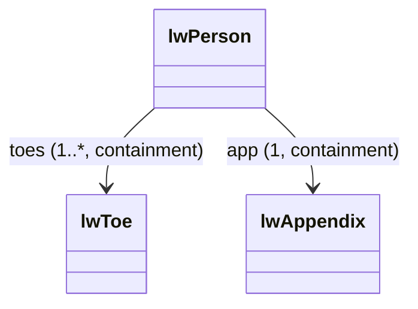
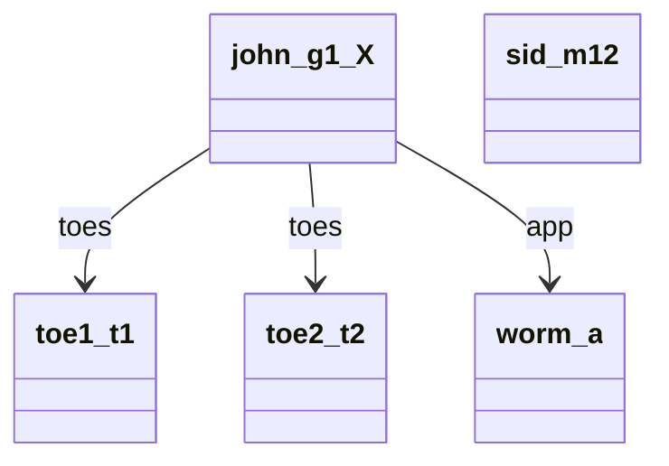

The LionWeb C# framework always keep the nodes in a tree. This means that every node has zero or one parents, and this parent contains the node. As a consequence, simple assignments of containments can have side effects.

:::note
This only concerns _containments_.
We can freely assign _LionWeb references_ without side effects.
:::





```csharp
class Person {
  ...
  public IReadOnlyList<Toe> Toes { get; }
  public Person AddToes(IEnumerable<Toe> nodes);
  public Person InsertToes(int index, IEnumerable<Toe> nodes);
  public Person RemoveToes(IEnumerable<Toe> nodes);
    
  public Appendix App { get; set; }
  public Person SetApp(Appendix value);
}

...

Toe toe1 = new Toe("t1");
Toe toe2 = new Toe("t2");
Appendix worm = new Appendix("a");
Person john = new Person("g1_X") { Toes = [toe1, toe2], App = worm };
Person sid = new Person("-12");

sid.App = john.App  ;               <1>
john.App;                           // throws UnsetFeatureException

Toe firstToe = john.Toes.First();   <2>
Toe lastToe = john.Toes.Last();

sid.AddToes([firstToe, lastToe]);   <3>
joh.Toes;                           // throws UnsetFeatureException    
````

We assign John's App to Sid.
For C#, that's just a C# reference -- several places can refer to the same C# object.
But for LionWeb, that's a containment, and we _must not_ have two parents for `worm`!
Thus, we detach `worm` from John, and attach it to Sid:

```mermaid
classDiagram

%% === Nodes (sanitized) ===
class john_g1_X
class sid_m12
class toe1_t1
class toe2_t2
class worm_a

%% === Containments ===
john_g1_X --> toe1_t1 : toes
john_g1_X --> toe2_t2 : toes
sid_m12 --> worm_a : worm
````

Now, John's App is `null`, even though it's _required_.
Consequently, we'd get a `UnsetFeatureException` in the next line if we tried to get John's App.

We get John's first Toe, i.e. `toe1`.
That's ok, as we only store it in a local variable -- no effect on the tree.

We add several of John's Toes to Sid.
Again, we _must not_ have two parents for the same toe, so we detach them from John, and attach them to Sid:

```mermaid
classDiagram

%% === Nodes (sanitized) ===
class john_g1_X
class sid_m12
class toe1_t1
class toe2_t2
class worm_a

%% === Containments ===
sid_m12 --> toe1_t1 : toes
sid_m12 --> toe2_t2 : toes
sid_m12 --> worm_a : worm
````

Now, John's Toes are empty, even though the link is _required_.
Consequently, we'd get a `UnsetFeatureException` in the next line if we tried to get John's Toes.

To summarize, the LionWeb framework always keeps the tree, even if it has to violate _required_ constraints.
It helps the developer to adhere to required flags by throwing specializations of `LionWebExceptionBase` on direct attempts to violate the constraints.

### Diagram Legend
```mermaid
classDiagram

%% LionWeb node A references node B in containment "aunt"
class A_ref
class B_ref
A_ref --> B_ref : aunt

%% LionWeb node A contains node B in containment "aunt"
class A_contain
class B_contain
A_contain --> B_contain : aunt (containment)

%% LionWeb node with Name property
class name_g1_X {
  Name = "John"
}

%% Node A is instance of concept B
class A_inst
class B_concept
A_inst ..|> B_concept : instance of

%% LionWeb concept with multiple, required reference
class A_concept_ref
class B_concept_ref
A_concept_ref --> B_concept_ref : aunts (1..*)

%% LionWeb concept with optional containment
class A_concept_contain
class B_concept_contain
A_concept_contain --> B_concept_contain : aunt (0..1 containment)

%% LionWeb concept with required property
class ConceptName {
  +Name: string
}

%% C# object A's Property "aunt" references object B
class A_cs_obj
class B_cs_obj
A_cs_obj --> B_cs_obj : aunt

%% C# object at memory location 0xa1e with Name = John
class name_0xa1e {
  Name = "John"
}

%% C# object A is instance of class B
class A_instance
class B_class
A_instance ..|> B_class

%% C# class with reference of cardinality 0..1
class CSharpA
class CSharpB
CSharpA --> CSharpB : aunt (0..1)

%% C# class with Name property
class ClassName {
  Name: string
}
```